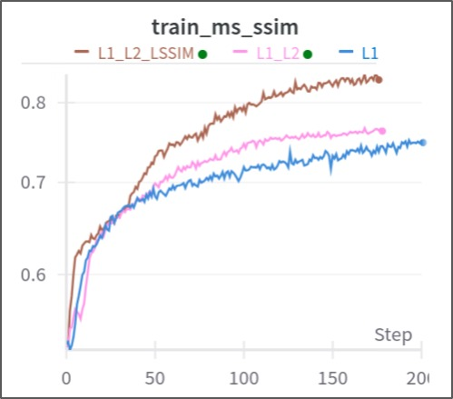
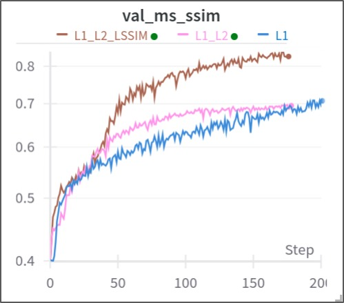

# Integrating-Spatial-Transform-Networks-with-PaDim-Architecture

Authors: Renato-Castro, Cristian Lazo Quispe.

Anomaly detection, an essential component of industrial quality control and surveillance, plays a crucial role in identifying deviations from normal patterns. This extended abstract explores a preliminary research focused on enhancing the anomaly detection capabilities of the PaDim architecture—a state-of-the-art solution for anomaly detection on the MVTEC dataset—through the integration of Spatial Transform Networks (STNs). The aim is to improve performance, particularly in challenging classes such as "zipper" and "screw," where the PaDim architecture achieves lower metrics of performance. Notably, these challenging scenarios often involve objects in non-fixed positions, making anomaly detection intricate in real-world complex scenarios. Through experimentation involving the integration of a Spatial Transform Network using self-supervised training, the performance of this innovative approach is evaluated and it sheds light on both the strengths and limitations of this integration, providing insights into the benefits of leveraging Spatial Transform Networks to handle real-world complexity.


# Project based On
This project is based on the Github PaDiM-Anomaly-Detection-Localization-master: [https://github.com/xiahaifeng1995/PaDiM-Anomaly-Detection-Localization-master/tree/main]


# Results

Self-supervised learning Results 

[https://wandb.ai/ml_projects/neurips_23/reports/Enhancing-anomaly-detection-using-Spatial-Transformers-Nets--Vmlldzo2MjM0MjIy?accessToken=cusdx2o0y4ne8o5mqt4rgcv3chw25k7un3dxqri1uzp9zyl3lk7kinfo73rr17fg]






# Requirements

<p>Libraries:</p>
  <li>Pytorch</li>
  <li>NumPy</li>
  <li>sklearn</li>
  <li>Pillow</li>
  <li>Scipy</li>
  <li>Skimage</li>
  <li>Matplotlib</li>

-------------------- 

# Downloading Dataset

Follow the next steps to download the dataset:

<li>Go to the link: https://www.mvtec.com/company/research/datasets/mvtec-ad</li>
<li>Check the neccesary boxes for downloading the dataset.</li>
<li>Click on SUBMIT AND CONTINUE TO DOWNLOAD PAGE.</li>
<li>Click on DOWNLOAD THE WHOLE DATASET.</li>
<li>Move the downloaded zip file to the Github directory of this project and extract it in the data folder.</li>

# Downloading Trained Weights

In order to test the performance of the project. You can follow the next steps to download the trained weights:

<li>Go to the link: https://drive.google.com/drive/folders/1pH3GR_9g2JMZse5gysyVmlFI0aoE_U1p?usp=sharing</li>
<li>Download one or both folders.</li>
<li>Move the folder(s) to this project path called "results/mvtec_result".</li>

# Test

<p>Command Linux Terminal :</p> 

```python
  execute python train_stn_model.py
```
```python
  execute python train_padim.py
```


## Run model in background

https://medium.com/swlh/introduction-to-process-handling-in-cmd-and-using-terminal-multiplexers-for-uninterrupted-bfd1bf2c16c2


To exit a tmux session, press control and ‘B’ together. Then, press ‘D’ to detach yourself from the session. You can also create sessions with a specific name using the following command:

    tmux new -s '<name>'
    

    tmux new -s session_01
  
You can list all running tmux sessions using ‘tmux ls’. You can attach your window to a specific session using its name in the following command:

    tmux a -t ‘<name>’
    tmux a -t session_01

You can also kill a particular session using the following command:

    tmux kill-session -t ‘<name>’
    tmux kill-session -t session_01


  watch -n 1 nvidia-smi


git remote set-url origin https://TOKEN@github.com/CristianLazoQuispe/Integrating-Spatial-Transform-Networks-with-PaDim-Architecture.git

